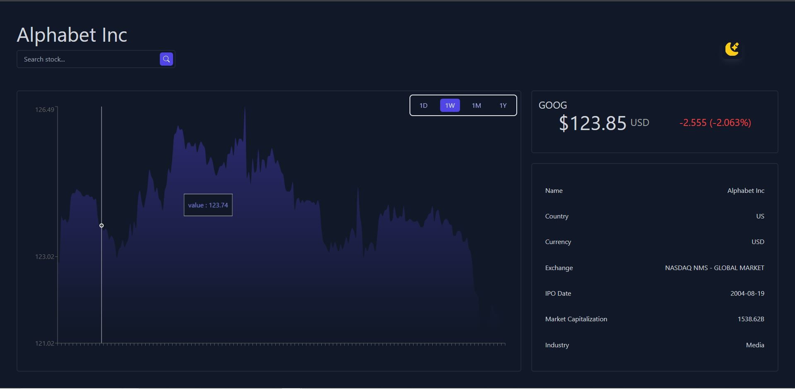

# Simple Stock Chart Dashboard

This web application is a simple stock viewing app built with React on RemixJS. It allows users to search for stock symbols and view their historical data using the API from [Finnhub](https://finnhub.io/). The app utilizes the Recharts library to display interactive and visually appealing charts.



## Features

- Search for stock symbols
- View historical data for selected stocks
- Interactive charts for visualizing stock data

## Technologies Used

- React
- RemixJS
- Finnhub API
- Recharts

## Getting Started

1. Clone the repository:

   ```bash
   git clone https://github.com/huelight/stockview.git

2. Install the dependencies:
    ```
    cd Simple-Stock-Chart-Dashboard
    npm install

3. Set up the API key:
    Obtain an API key from Finnhub.
    Rename the .env.example file to .env and replace YOUR_API_KEY with your actual API key.

4. Start the development server:
   ```
   npm run dev

5. Open your browser and navigate to http://localhost:3000 to access the app.


## License
    This project is licensed under the MIT License.
